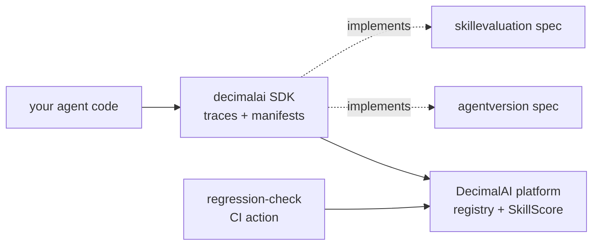

# DecimalAI Python SDK

**Catch what your next agent change will break** — a structural regression check against your recorded traces, built on manifest-aware versioning of your agent's tools, prompts, models, and skills. The open source SDK for [DecimalAI](https://decimal.ai).

[](https://pypi.org/project/decimalai/)
[](https://pepy.tech/project/decimalai)
[](https://github.com/decimal-labs/decimalai-python/actions/workflows/ci.yml)
[](https://pypi.org/project/decimalai/)
[](https://github.com/decimal-labs/decimalai-python/blob/main/LICENSE)
[](https://colab.research.google.com/github/decimal-labs/decimalai-python/blob/main/examples/support-agent/support_agent.ipynb)

[Docs](https://docs.decimal.ai) · [Registry](https://app.decimal.ai/skills) · [Leaderboard](https://app.decimal.ai/skills/leaderboard) · [Changelog](https://docs.decimal.ai/changelog)


## Installation

```bash
pip install decimalai
# or
uv pip install decimalai
```

Requires **Python 3.10+** (`pip` won't install current releases on older Pythons).

The core install is deliberately thin (tracing, CLI, manifests, skills). Framework and provider adapters ship as extras — install the one matching your stack:

```bash
pip install "decimalai[langchain]"       # LangChain (add [langgraph] for LangGraph)
pip install "decimalai[openai-agents]"   # OpenAI Agents SDK
pip install "decimalai[all]"             # everything
```

Available extras: `[langchain]`, `[langgraph]`, `[openai]`, `[openai-agents]`, `[llamaindex]`, `[claude-agent-sdk]`, `[pydantic-ai]`, `[adk]`, `[evals]`, `[all]`.

## See it in 2 minutes

The regression demo seeds a reference agent (v1 → v2 + a trace corpus) into your workspace and runs the exact pipeline a real PR check runs. It needs a free API key — that's the only setup:

```bash
export DECIMAL_API_KEY="dai_sk_..."   # free key from app.decimal.ai/settings
decimalai demo regression             # → impact report: what your next change would break
```

The impact report it produces looks like this — captured with the SDK's `decimalai regression-check` against the seeded reference agent, trimmed:

```text
  🔍 Decimal Manifest Impact — [Demo] support-agent

  Manifest changes:
    🟡 tool_renamed — lookup_price
    🟢 tool_added — refund_order
    🟡 prompt_section_rewritten — system_prompt  [major, 88.6% changed]
    🔴 model_changed — gpt-4o-mini  (gpt-4o-mini-2024-07 → gpt-4o-mini-2024-09)
    🔴 tool_removed — compare_competitors

  Training-data policy (default):
    prompt_section_rewritten (major) → replay — need re-running first
    model_changed (major) → drop — excluded from training
```

Everything above comes from a **seeded reference agent — illustrative, run it yourself**. On your own instrumented agent, each change is additionally checked against your recorded traces — a high/medium/low blast radius per trace, not just the structural diff. The API key is needed because the demo seeds data into a workspace on the platform; `decimalai demo reset` removes it all.

No key at all? Two things work without one:

- `decimalai skills pull <slug>` — fetch any published SKILL.md to disk, no account.
- The [`agentversion`](https://pypi.org/project/agentversion/) manifest flow ([below](#open-standard-agentversion)) — diff and gate agent manifests fully locally.

There's a second demo for the registry side:

```bash
decimalai demo skills       # → tour the registry: security-scanned skills, benchmarkable with an open A/B spec
```

Browsing without an account? Explore the [public skill registry](https://app.decimal.ai/skills) — no signup required.

## Quick Start

### LangChain / LangGraph — Zero-Code Tracing

```python
import decimalai

decimalai.init(langchain=True)  # That's it — chains, graphs and agents auto-traced

# Use LangChain as normal — nothing else changes
from langchain_openai import ChatOpenAI
from langchain_core.prompts import ChatPromptTemplate

chain = ChatPromptTemplate.from_template("Tell me about {topic}") | ChatOpenAI(model="gpt-4o")
result = chain.invoke({"topic": "otters"})  # ← one trace, sent when the chain completes
```

A trace is sent when a **chain, agent, or graph run completes**. A bare `llm.invoke("Hello!")`
with no surrounding chain never reaches that boundary, so it sends nothing — wrap the call, or
see [manual tracing](https://docs.decimal.ai/sdk/python/frameworks/langchain) for the per-call
handler.

### OpenAI Agents SDK

```python
import decimalai

decimalai.init(openai_agents=True)
```

### Any Framework — Manual Tracing

```python
import decimalai

decimalai.init()

@decimalai.trace(agent_name="my-agent")
def run_agent(query):
    msgs = [{"role": "user", "content": query}]
    resp = openai.chat.completions.create(model="gpt-4o", messages=msgs)
    decimalai.log_llm_call(
        model="gpt-4o",
        input=msgs,
        output={"content": resp.choices[0].message.content},
    )
    return resp.choices[0].message.content
```

### Environment Variable Setup (No Code Changes)

```bash
export DECIMAL_API_KEY=dai_sk_...
export DECIMAL_AUTO_TRACE=langchain   # or "openai-agents"
# Just run your app — tracing activates on import
python app.py
```

## What It Does

- **Auto-tracing** — Captures LLM calls, tool calls, and agent steps with zero code changes
- **Agent versioning** — Auto-detects tool schemas, prompts, models, and graph topology
- **Change detection** — Detects when your agent configuration drifts
- **Inline evals** — Run eval functions on every trace with `@decimalai.evals.eval`
- **Built-in deterministic scores** — `completion`, `has_output`, `tool_compliance`, `latency`, `token_efficiency` attached to every trace by the SDK (disable with `install(..., builtin_evals=False)`). These run **in your process**, not server-side — bare HTTP `POST /traces` does not auto-score.
- **Batch evals** — Run evals offline across historical traces
- **Dataset pull** — One-liner to download versioned training data: `decimalai.pull_dataset("ds_abc", "./data.jsonl")`
- **HuggingFace Hub** — Push datasets to HF Hub for instant Axolotl/Unsloth/TRL compatibility
- **Fine-tuning** — Launch fine-tuning jobs on OpenAI, Together.AI, or Gemini from the platform
- **Skills management** — Auto-discover SKILL.md files, sync to platform, install from registry
- **OTel compatible** — Export spans to any OpenTelemetry backend

## How it fits together

The SDK is the client for the hosted platform and the reference implementation of two open specs — everything it captures is portable by design:



- [`agentversion`](https://pypi.org/project/agentversion/) — the open manifest spec (versioning, diffing, compatibility)
- [`skillevaluation`](https://pypi.org/project/skillevaluation/) — the open A/B spec for measuring a skill's lift
- [`regression-check`](https://github.com/decimal-labs/regression-check) — the GitHub Action that runs the per-PR structural check

## How does DecimalAI compare?

DecimalAI is not a tracing or eval-case platform — it's the structural layer that runs alongside one. LangSmith, Braintrust, and promptfoo watch your agent's *outputs*; DecimalAI versions its *structure* (tools + prompts + models + skills) and diffs every change against your recorded production traffic. Keep your eval tool; add the manifest layer under it.

| Capability | DecimalAI | LangSmith | Braintrust | promptfoo |
|---|---|---|---|---|
| Structural regression check against production traces — no eval cases to write | ✅ per-PR impact report ([regression-check](https://github.com/decimal-labs/regression-check)) | ❌ needs datasets; online evals score outputs | ❌ needs datasets; online scoring rates outputs | ❌ needs test cases you write |
| Whole-agent version manifest, diffable with an open spec | ✅ [agentversion](https://pypi.org/project/agentversion/) — tools + prompts + models + skills | Prompts only (Prompt Hub commits) | Prompts only (versioned prompts + experiments) | ❌ config versioning via your own git |
| Open A/B spec to measure a skill's lift — re-runnable by anyone | ✅ [skillevaluation](https://pypi.org/project/skillevaluation/) | ❌ | ❌ | ❌ |
| Skills registry with pre-publish security scanning | ✅ deterministic scan blocks unsafe skills before publish | ❌ | ❌ | ❌ |
| Output-quality evals: datasets, LLM-as-judge, playgrounds | ❌ by design — keep your eval tool alongside | ✅ | ✅ | ✅ |
| Adversarial red-teaming of your own app | ❌ | ❌ | ❌ | ✅ |
| Fully open source, runs 100% locally | Partial — SDK, Action, and specs are MIT / Apache-2.0; the platform is hosted | ❌ self-host is Enterprise-only | ❌ self-host is Enterprise-only | ✅ |

The regression demo (`decimalai demo regression`) runs the real pipeline on a **seeded reference agent** — its numbers are illustrative; run it yourself, then instrument your own agent for real ones. Competitor capabilities checked against each tool's public docs, August 2026.

## Skills

DecimalAI auto-discovers your existing [SKILL.md](https://agentskills.io) files and provides observability — tracking which skills activate, how effective they are, and how they change over time.

### Auto-Discovery (Bring Your Own Skills)

If you already have SKILL.md files (from `npx skills add`, your team's repo, or hand-written), the SDK discovers them automatically:

```python
import decimalai
decimalai.init(api_key="dai_sk_...")

from decimalai.openai_agents import instrument
instrument()  # Scans .claude/skills/, .agents/skills/, etc. → syncs to dashboard
```

Supports 32 agent runtimes: Claude Code, Cursor, Copilot, Windsurf, Continue, and more.

### Registry Search & Install

Find community skills and install them in one call:

```python
from decimalai.skill_router import SkillRouter
router = SkillRouter(api_key="dai_sk_...")

# Search the public registry
results = router.search("code review security")

# Install a skill — a LINK into your workspace, tracking the author's updates
router.use("pdf")

# Write the files to disk, for runtimes that load SKILL.md themselves
router.export("pdf", agents=["claude-code", "cursor"])

# Take an editable copy, only if you intend to change it
router.fork("pdf")
```

### Status & Update

```python
# Check sync status between local files and platform
status = router.status()
# → {"synced": [...], "modified_locally": [...], "untracked": [...]}

# Pull upstream updates
router.update_skills()
```

### Skill Delivery at Runtime (`enable_skill_loader`)

Discovery and sync (above) get skills *into the platform*. To get them **into your agent's context at runtime**, enable the skill loader on your adapter's `instrument()`:

```python
import decimalai
decimalai.init()

from decimalai.openai_agents import instrument  # or .langchain / .anthropic / .pydantic_ai
instrument(enable_skill_loader=True)
```

With the loader on, the router adds a ranked **menu** of relevant skills to the prompt (one short row per skill: name + when to use it). A menu row alone is only an *offer* — the skill's actual content (its body) reaches the model through one of three delivery mechanisms:

- **Body injection** (opt-in) — `decimalai.init(inject_skill_body=True)` (or `DECIMALAI_INJECT_SKILL_BODY=1`) injects the top-routed skill's full body into the prompt, trimmed to a token budget. Works on adapters that route on the user query (`openai_agents`, `langchain`, `anthropic`); Pydantic AI builds its prompt in full-menu mode (no query available), so bodies arrive via `load_skill` there instead.
- **`load_skill` tool** — on adapters that own their tool loop, a `load_skill` tool registers automatically whenever the loader is enabled, so the model can fetch any offered skill's body mid-turn. On by default; kill switch: `decimalai.init(load_skill_tool=False)` or `DECIMALAI_LOAD_SKILL_TOOL=0`. It is **not** an `instrument()` parameter on these adapters.
- **Export to disk** — for runtimes that natively load skills from files (Claude Code, Cursor, ...), write them out with `router.export(...)` or `decimalai skills export` and let the runtime deliver them. Export takes no copy and needs no fork; you can export a skill you only linked.

Delivery support differs per adapter — the asymmetry is structural (`load_skill` needs a tool loop the adapter controls):

| Adapter | Menu + body injection | `load_skill` tool | Notes |
|---|---|---|---|
| `decimalai.openai_agents` | ✅ | ✅ | tool auto-registers with the loader |
| `decimalai.pydantic_ai` | ✅ menu / ❌ body injection | ✅ | full-menu mode (no query at prompt-build time) — bodies arrive via `load_skill` |
| `decimalai.langchain` | ✅ | ❌ injection-only | `enable_load_skill_tool` accepted but dormant (warns) |
| `decimalai.anthropic` | ✅ | ❌ injection-only | patches a single `messages.create()` — no loop to route a tool result back |
| `decimalai.claude_agent_sdk` | ❌ disk-only | ❌ | tracing-only adapter; Claude Code loads skills itself from `.claude/skills/` |
| generic (`@decimalai.trace`) | ❌ disk-only | ❌ | no prompt-assembly hook; use disk install |

Honest-measurement note: menu-only (loader on, no body injection, no `load_skill` tool) means the model sees that a skill *exists* but never its content. Usage from that channel counts as **offered**, not **activated** — don't expect activation stats from prompt-injection-only setups.

### Other Ways to Use Skills (No SDK)

Every published skill is reachable without installing anything:

- **Web copy-paste** — open any skill's scorecard page on [app.decimal.ai/skills](https://app.decimal.ai/skills), hit **Copy SKILL.md**, and paste it into your repo.
- **Raw URLs** — `https://app.decimal.ai/s/<slug>/SKILL.md` serves the raw markdown (version-pinned: `/s/<slug>@<version>/SKILL.md`); `https://app.decimal.ai/s/<slug>.json` serves machine-readable metadata (lift summary, benchmark models, trust/safety bands); `https://app.decimal.ai/llms.txt` indexes the registry for agents.
- **CLI pull (no account)** — `decimalai skills pull <slug>` writes just the file to disk; no fork, no signup. (`decimalai skills install <slug>` forks + syncs if you do have a key.)
- **MCP server** — search and read skills from any MCP client (`pip install decimalai-mcp`).
- **Claude Code plugin** — `/decimalai:install <slug>` from inside Claude Code (not yet available).

See the full [SDK Skills Reference](https://docs.decimal.ai/sdk/python) for all methods.

## Datasets & Training

### Pull Training Data

```python
import decimalai
decimalai.init()

# Pull the latest version to a local file
result = decimalai.pull_dataset("ds_abc123", "./training_data.jsonl")
print(f"Wrote {result['row_count']} rows")

# Pull a specific version
result = decimalai.pull_dataset("ds_abc123", "./data.jsonl", version="v2")
```

### Push to HuggingFace Hub

```python
# Push to HF Hub — instantly loadable by Axolotl, Unsloth, TRL
result = decimalai.push_to_hub("ds_abc123", "my-org/support-agent-sft")

# Now usable everywhere:
# from datasets import load_dataset
# ds = load_dataset("my-org/support-agent-sft")
```

### Load as HuggingFace Dataset (In-Memory)

```python
# Skip files — load directly into your training script
ds = decimalai.load_hf_dataset("ds_abc123")
# → Dataset({features: ['messages'], num_rows: 500})
```

### CLI

```bash
# Pull latest version
decimalai datasets pull ds_abc123 -o ./training_data.jsonl

# Pull specific version as Parquet
decimalai datasets pull ds_abc123 -o ./data.parquet --version v2

# Push to HuggingFace Hub
decimalai datasets push-to-hub ds_abc123 my-org/support-agent-sft
```

### Fine-Tuning Providers

| Provider | Models | Setup |
|----------|--------|-------|
| OpenAI | GPT-4o, GPT-4.1-mini | Dashboard or API |
| Together.AI | Llama 4, Qwen 3, DeepSeek R1, Mistral | Dashboard or API |
| Gemini | Gemini 2.5 Flash/Pro | Dashboard or API |

## Supported Frameworks

| Framework | Status | Setup |
|-----------|--------|-------|
| LangChain / LangGraph | ✅ | `init(langchain=True)` |
| OpenAI Agents SDK | ✅ | `init(openai_agents=True)` |
| Google ADK | ✅ (native) | `init(adk=True)` |
| Anthropic Claude Agent SDK | ✅ (native) | `init(claude_agent_sdk=True)` |
| LlamaIndex | ✅ | `init(llamaindex=True)` |
| CrewAI | ✅ | `init(crewai=True)` |
| AutoGen / AG2 | ✅ | `init(autogen=True)` |
| Generic (any framework) | ✅ | `@decimalai.trace()` |
| OpenTelemetry | ✅ | `init(otel=True)` |

Tracing a direct LLM SDK with no agent framework? Use the provider flags: `init(openai=True)`, `init(anthropic=True)`, or `init(google=True)`.

## Examples

See the [`examples/`](https://github.com/decimal-labs/decimalai-python/tree/main/examples) directory for runnable notebooks with **Open in Colab** badges:

| Notebook | Description | Colab |
|----------|-------------|-------|
| [Quickstart](https://github.com/decimal-labs/decimalai-python/blob/main/examples/quickstart/quickstart.ipynb) | Full version-aware loop — no LLM key needed | [](https://colab.research.google.com/github/decimal-labs/decimalai-python/blob/main/examples/quickstart/quickstart.ipynb) |
| [LangChain](https://github.com/decimal-labs/decimalai-python/blob/main/examples/quickstart/quickstart_langchain.ipynb) | Instrument a LangChain agent | [](https://colab.research.google.com/github/decimal-labs/decimalai-python/blob/main/examples/quickstart/quickstart_langchain.ipynb) |
| [OpenAI Agents](https://github.com/decimal-labs/decimalai-python/blob/main/examples/quickstart/quickstart_openai_agents.ipynb) | Instrument an OpenAI Agents app | [](https://colab.research.google.com/github/decimal-labs/decimalai-python/blob/main/examples/quickstart/quickstart_openai_agents.ipynb) |
| [Evaluations](https://github.com/decimal-labs/decimalai-python/blob/main/examples/evaluations/builtin_evaluators.ipynb) | Run built-in evaluators on traces | [](https://colab.research.google.com/github/decimal-labs/decimalai-python/blob/main/examples/evaluations/builtin_evaluators.ipynb) |
| [Datasets](https://github.com/decimal-labs/decimalai-python/blob/main/examples/datasets-and-training/build_sft_dataset.ipynb) | Build SFT training datasets | [](https://colab.research.google.com/github/decimal-labs/decimalai-python/blob/main/examples/datasets-and-training/build_sft_dataset.ipynb) |
| [Pull & Push](https://github.com/decimal-labs/decimalai-python/blob/main/examples/datasets-and-training/pull_and_push.py) | Pull datasets locally, push to HuggingFace Hub | — |
| [Version-Aware Loop](https://github.com/decimal-labs/decimalai-python/blob/main/examples/version-aware-loop/manifest_change.ipynb) | Detect manifest changes and impact | [](https://colab.research.google.com/github/decimal-labs/decimalai-python/blob/main/examples/version-aware-loop/manifest_change.ipynb) |

## Open standard: agentversion

The manifests this SDK captures are [`agentversion`](https://pypi.org/project/agentversion/) manifests — the open spec for agent versioning, diffing, and compatibility decisions that DecimalAI is built on. `export_manifest` hands a captured manifest to the OSS tooling, so you can diff and gate it in CI with **no platform account**:

```python
import decimalai
from decimalai.schema.manifest import extract_from_config
from agentversion.diff import diff_manifests              # pip install agentversion
from agentversion.compatibility import classify_compatibility

snap = extract_from_config(agent_name="support-agent", prompts={...}, models={...})
manifest = decimalai.export_manifest(snap)                # → an agentversion manifest dict
print(classify_compatibility(diff_manifests(last_prod, manifest)).recommended_decision)
```

You can reproduce the platform's diffs and verdicts entirely outside DecimalAI — the SDK is the convenience layer over the open standard.

## FAQ

<details>
<summary><strong>How is this different from LangSmith / Braintrust / Weave?</strong></summary>

They watch your agent's outputs — traces, eval scores, feedback. DecimalAI watches its structure: a versioned manifest of tools + prompts + models + skills, diffed against your recorded traffic. Tracing answers "what happened," evals answer "how well," this answers "is this data still usable now that the agent changed?" It's not either/or — DecimalAI runs alongside them, and we recommend keeping your tracing tool.
</details>

<details>
<summary><strong>Isn't the regression check just a linter?</strong></summary>

A linter checks code against static rules someone wrote. This checks an agent change against your actual production history: for each recorded trace, did it depend on a surface this change touches? There's no ruleset to write or maintain — your traffic is the ruleset. The output isn't "style violation," it's "these conversations will break and this slice of your training set is now stale."
</details>

<details>
<summary><strong>Are the demo's numbers real? Whose traffic is that?</strong></summary>

The demo runs on a seeded reference agent built for the demo — not a customer's traffic. The pipeline is the real one; the numbers are illustrative, and we say so everywhere they appear. When you run the check on your own instrumented agent, it's your traffic in your workspace.
</details>

<details>
<summary><strong>Is the "lift" number on a skill real? Can I reproduce it?</strong></summary>

The measurement spec is open: same task set run in two arms (with the skill injected vs. without), same model, conformance-graded, with a minimum case count, a never-hurt check, and a negative control. `pip install skillevaluation` and re-run any published number. The honest state today: effectiveness figures on the site are labeled "illustrative — run it yourself" until a skill's full benchmark run lands — no skill is claimed as measured unless its number was actually produced by that spec.
</details>

<details>
<summary><strong>What data leaves my machine? Do you run my agent?</strong></summary>

DecimalAI never runs your agent and never holds your LLM API keys. The SDK sends traces to your workspace; the PR check is a read query over your own trace store — zero LLM calls. The optional `mode=real` call-replay uses your key, on your opt-in, for same-provider swaps only. Everything the SDK sends is visible in your dashboard and exportable.
</details>

<details>
<summary><strong>Do I need an account?</strong></summary>

For the regression check and tracing, yes — a free API key (traces have to live somewhere). Without any account you can still: browse the [registry](https://app.decimal.ai/skills), pull any published skill with `decimalai skills pull <slug>`, and diff agent manifests fully locally with [`agentversion`](https://pypi.org/project/agentversion/).
</details>

<details>
<summary><strong>Can I self-host? Why isn't the whole platform open source?</strong></summary>

The measurement layer is open on purpose: [`skillevaluation`](https://pypi.org/project/skillevaluation/) (the A/B eval spec + runner) and [`agentversion`](https://pypi.org/project/agentversion/) (the manifest spec) are on PyPI, and this SDK and the [GitHub Action](https://github.com/decimal-labs/regression-check) are MIT. Every number published is checkable without trusting us. The hosted platform — the trace store, the registry, the scanning pipeline — is not open source; charging for hosting is how a solo-founder project survives. Worst case, you lose a vendor, not your history: the specs are open and your traces are exportable.
</details>

<details>
<summary><strong>Why should I trust the security scanner?</strong></summary>

Don't trust it — test it. The first-tier scan is deterministic and findings are shown in full; we planted a skill with a hidden reverse shell against our own registry and it was blocked with 2 critical findings, no human in the loop. And the honest part: a scan is a floor, not a guarantee — which is why there's an intent-review tier on top, an appeal path for authors, and no "0 false positives" claim anywhere.
</details>

## Development

```bash
pip install -e ".[dev]"
python -m pytest tests/ -q --ignore=tests/test_langchain_compat.py
ruff check decimalai/ --select I,E,W,F --ignore E501,E402,F821,F841
git grep -nE 'decimal[-_]ai'   # must find nothing — the package is 'decimalai', no separator
```

Run these before opening a PR. CI runs the same commands, plus the LangChain compatibility matrix in `tests/test_langchain_compat.py`. See [`AGENTS.md`](https://github.com/decimal-labs/decimalai-python/blob/main/AGENTS.md) if you're pointing an AI coding agent at this repo.

## Documentation

Full docs at [docs.decimal.ai](https://docs.decimal.ai)

## License

MIT — see [LICENSE](https://github.com/decimal-labs/decimalai-python/blob/main/LICENSE) for details.

---

[Docs](https://docs.decimal.ai) · [Registry](https://app.decimal.ai/skills) · [SDK](https://github.com/decimal-labs/decimalai-python) · Specs: [agentversion](https://github.com/decimal-labs/agentversion) · [skillevaluation](https://github.com/decimal-labs/skillevaluation) · [regression-check](https://github.com/decimal-labs/regression-check)
